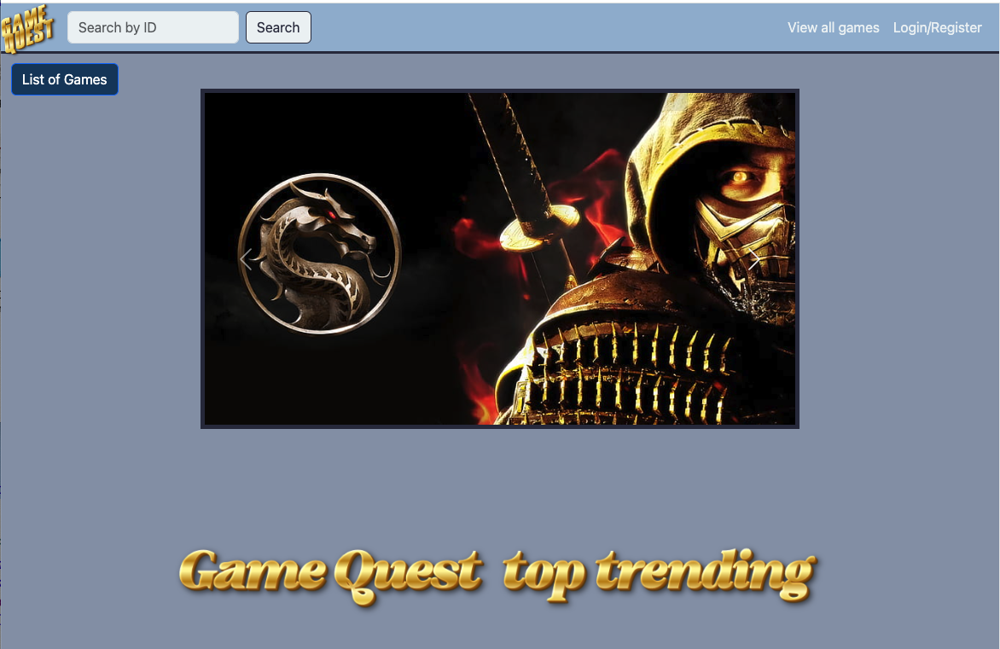
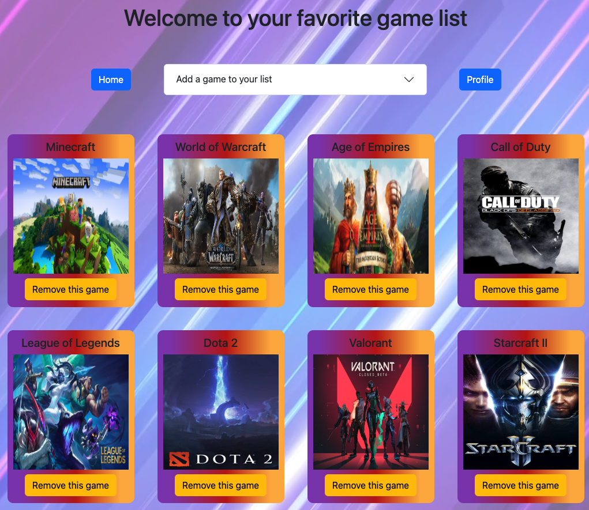
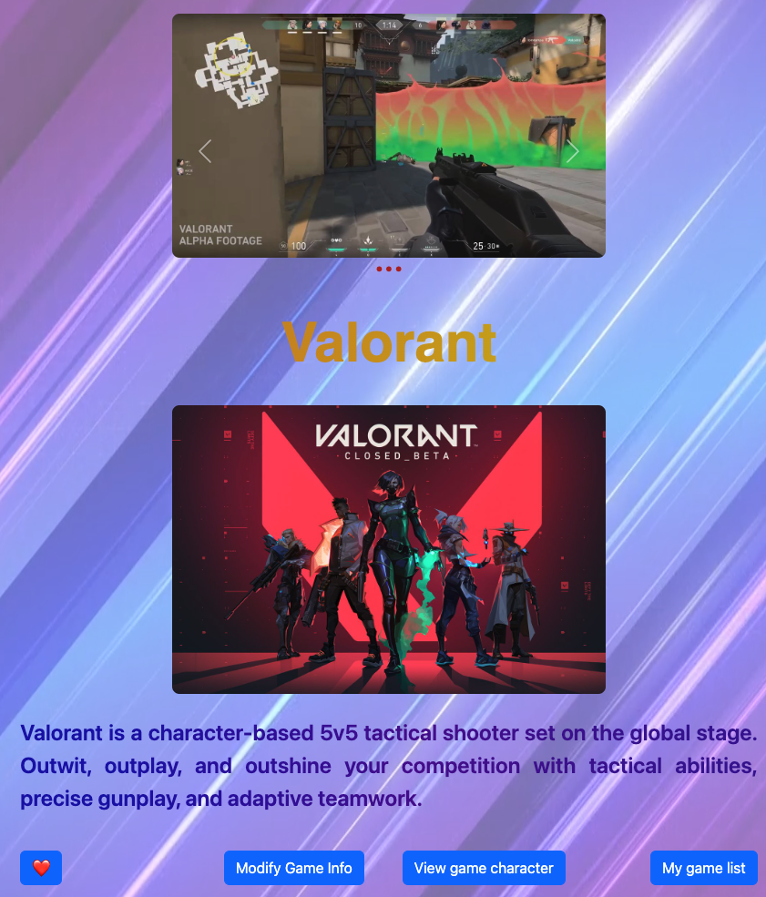
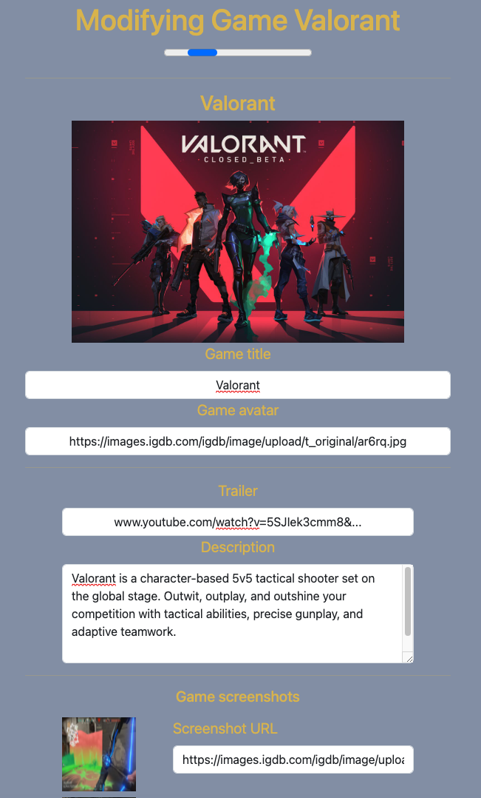

# MidtermProject

## How To Run

This project has been deployed to contributors' website hosted by AWS. Please visite the following sites to experience the full features of the app.

- Jimmy Tran site
- Jonathon McNamara site
- Christopher Rasmussen site

User can browse the project in guest view, or login using test account BillyBob with pass 123. Otherwise, user can register a new account with just the username and password. No personal information is stored in this app.

## Project Description

### App features highlight

- Experience stunning and resposive design with user-interface and user-experience in mind by using matrial design minimalist approach.
  

- Manage your profile and your list of favorite game like a pro
  

- View the information of your favorite game, no matter where you are in the app
  

- Interactively modify and link the information of the game you love
  

So what are you waiting for? Pay a visit to GameQuest and let your creativity soar.

### Interaction with the app

- Game Quest is a video game finder app that interacts with the user where they can learn more about games, keep track of games they are interested in, as well as dive deeper into some of the characters associated with said games.
- If a registered user is unable to find a game on the site they want to put up for others to visit, they may also create a game and update it as well
- From the home page, you can query games based on their id and add those games to your personalized game list(as long as you are a registered user)
- Once a game is added to your list, the game details page will allow you to see the characters associated with that game
- By clicking on a character name, you can visit and learn more information about those characters, as well as create, update, and delete your own for certain games

## Tech Stack - Technologies used

### Wireframing

- Figma

### Front end

- HTML
- CSS
- Bootstrap
- Javascript

### Back end

- Java
- Spring framework with Hibernate
- JPA, Boot, JSTL, MVC

### Database

- MySQL and MySQL workbench

### Hosting

- AWS with Tomcat 10

## Lessons Learned

- This project illustrated how imperative it is to be clear and concise with planning as well as being flexible to work with life circumstances(ex. moving) along with different timezones
- The planning of projects to this scale is more important than the coding. Once we have a vision of what we were making and made sure everything was mapped, the idea came to life way faster
- Allowing individual expression and freedom working on this project allowed for us to become more engaged with the project
- Communication on larger scale programs is truly the most important aspect
